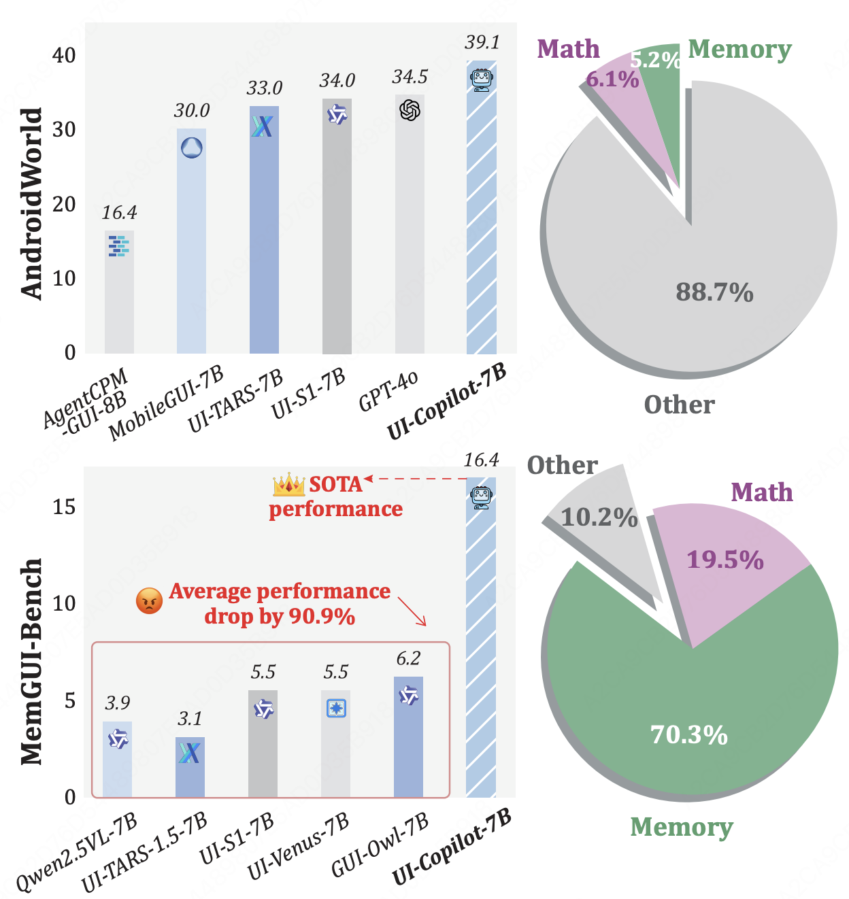
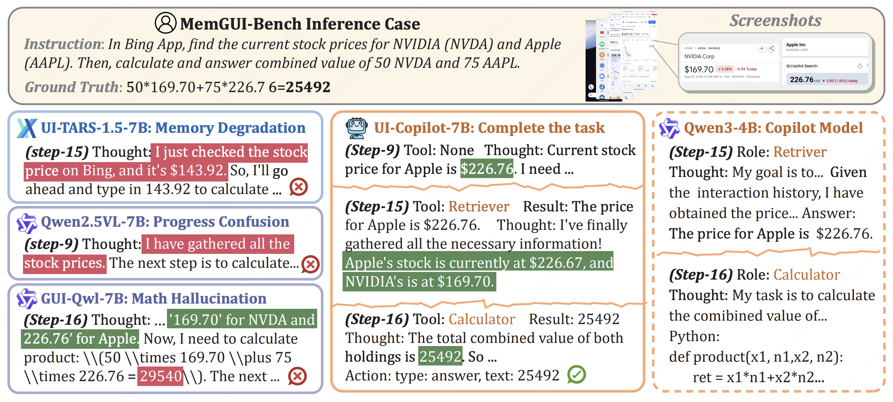
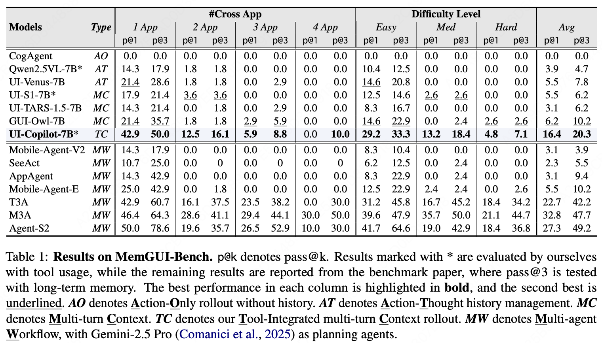

<h1 align="center">
UI-Copilot: Advancing Long-Horizon GUI Automation via Tool-Integrated Policy Optimization
</h1>


<div align='center' style="font-size:18px;">
<p>
    <a href="https://arxiv.org/abs/2604.13822">
      
    </a>
    <a href="https://huggingface.co/papers/2604.13822">
      
    </a>
  </p>
</div>

<p align="center">
Zhengxi Lu, Fei Tang, Guangyi Liu, Kaitao Song, Xu Tan, Jin Ma, Wenqi Zhang, Weiming Lu, Jun Xiao, Yueting Zhuang, Yongliang Shen
</p>


## 🔥 Overview
We propose UI-Copilot, a collaborative framework where the GUI agent selectively invokes a lightweight copilot for memory retrieval and numerical computation, enabling efficient long-horizon GUI navigation.

<div align="center" style="display:flex; justify-content:center; gap:20px; align-items:flex-start;">
  
  
</div>


UI-Copilot achieves substantial improvements on MemGUI-Bench.
<div align="center">
  
</div>

## 🗞️ News
- **`2026-4-16`**: We release our paper and github repo.
- **`2026-4-06`**: 🔥 UI-Copilot was accepted by ACL 2026 main.

## 🛠️ Installation

Our code is based on [UI-S1](https://github.com/X-PLUG/MobileAgent/tree/main/UI-S1) and is on the way.

## ⭐️ Citation

If you find this project useful, welcome to cite us.

```bit
@misc{lu2026uicopilot,
      title={UI-Copilot: Advancing Long-Horizon GUI Automation via Tool-Integrated Policy Optimization}, 
      author={Zhengxi Lu and Fei Tang and Guangyi Liu and Kaitao Song and Xu Tan and Jin Ma and Wenqi Zhang and Weiming Lu and Jun Xiao and Yueting Zhuang and Yongliang Shen},
      year={2026},
      eprint={2604.13822},
      archivePrefix={arXiv},
      primaryClass={cs.LG},
      url={https://arxiv.org/abs/2604.13822}, 
}
```

## 🤝 Acknowledgement

This project builds on [verl-agent](https://github.com/langfengQ/verl-agent), [veRL](https://github.com/volcengine/verl), and [UI-S1](https://github.com/X-PLUG/MobileAgent/tree/main/UI-S1). We thank the authors of those projects.
